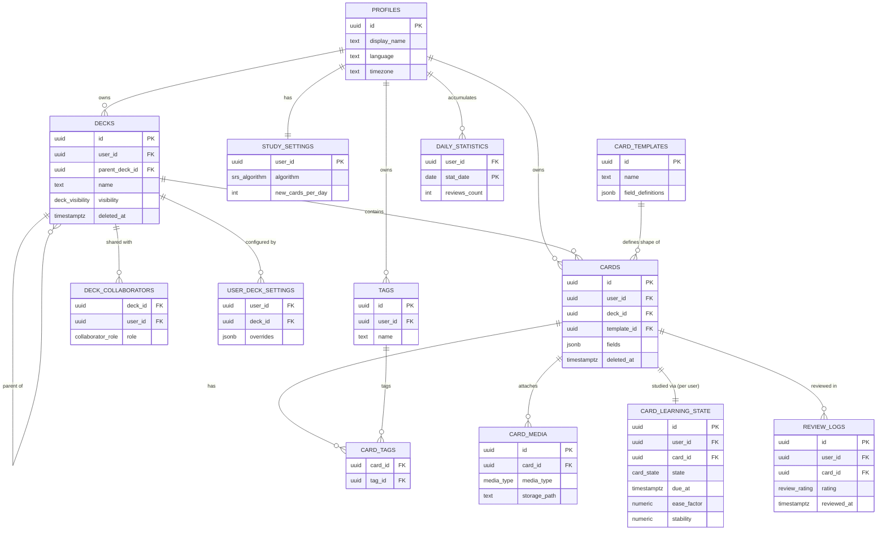

# Flashi — Arquitetura do Banco de Dados (Supabase / PostgreSQL)

## 1. Visão geral

13 tabelas em `public`, todas com RLS habilitado, PKs `uuid`, timestamps
`created_at`/`updated_at` (+ `deleted_at` onde soft delete se aplica).
Todo o cálculo do algoritmo de repetição espaçada (SM-2, FSRS) acontece na
camada de aplicação/edge function — o banco só persiste o resultado de
forma atômica via `record_review()`.

## 2. Decisões de arquitetura (e por que fugi um pouco do brief original)

| Decisão | Por quê |
|---|---|
| Estado do card (`new`/`learning`/...) vive em `card_learning_state`, **não** em `cards` | `cards` é conteúdo (pode ser de um deck público/compartilhado no futuro); o progresso de estudo é sempre por usuário. Colocar o estado direto no card quebraria multiusuário. |
| `notes` representa o fato e `cards` representa o exercício | Uma nota pode gerar vários cartões independentes (`basic`, `reverse` ou `cloze`). `cards.fields` continua flexível para manter compatibilidade com o conteúdo já existente. |
| `decks`/`cards`: sem política de `DELETE` no RLS | Usuário final nunca apaga fisicamente — só via `soft_delete_deck()` (UPDATE de `deleted_at`). Hard delete só é possível com `service_role` (job administrativo), preservando histórico de revisões. |
| `deck_collaborators` (nova tabela, não pedida explicitamente) | O enum `deck_visibility` já previa `'shared'`, mas nada modelava *quem* tem acesso. Sem essa tabela o valor `'shared'` seria decorativo. |
| Streak calculado via função (`get_current_streak()`), não armazenado | Uma coluna de streak acumulada tende a dessincronizar silenciosamente. Calcular sob demanda a partir de `daily_statistics` elimina esse risco. |
| `review_logs` imutável (sem UPDATE/DELETE, garantido em RLS **e** trigger) | É o registro de auditoria/histórico de estudo — nunca deve ser alterável, nem por bug de aplicação nem por acesso direto. |
| Sem particionamento de `review_logs` agora | Seria otimização prematura. Fica documentado como próximo passo (partição mensal por `reviewed_at`) quando o volume justificar (dezenas de milhões de linhas). |

## 3. Diagrama ER



## 4. Consultas essenciais

**Cards pendentes agora** (a consulta mais crítica do sistema, já otimizada
via `idx_learning_due`):
```sql
select * from get_due_cards(p_deck_id := null, p_limit := 30);
```

**Registrar uma revisão** (atômico: `review_logs` + `card_learning_state` +
`daily_statistics` em uma transação):
```sql
select record_review(
  p_card_id           := '...',
  p_rating             := 'good',
  p_time_spent_ms      := 4200,
  p_new_state          := 'review',
  p_new_interval_days  := 6,
  p_new_due_at         := now() + interval '6 days',
  p_new_stability      := 5.8,
  p_new_difficulty     := 4.1,
  p_algorithm          := 'fsrs'
);
```

**Streak atual:**
```sql
select get_current_streak();
```

**Apagar um deck (soft delete, cascateando subdecks e cards):**
```sql
select soft_delete_deck('...');
```

## 5. Storage

Bucket `card-media`, privado. Caminho obrigatório `{user_id}/...` — a
policy de `storage.objects` valida isso via `storage.foldername(name)`.

## 6. Sincronização multi-dispositivo

- Cada linha sincronizável tem `updated_at` (e `deleted_at` para soft
  delete). Cliente guarda `last_synced_at` e busca
  `where updated_at > $last_sync_at or deleted_at > $last_sync_at`.
- Resolução de conflito: **last-write-wins** por `updated_at`. Isso é
  aceitável para conteúdo (decks/cards), mas note a limitação: edições
  simultâneas em dois dispositivos podem perder uma das duas. Para
  `review_logs` isso não é problema — são inserts idempotentes (gere o
  `id` no cliente para deduplicar em reenvios).
- `device_id`/`session_id` em `review_logs` existem só para diagnóstico de
  sincronização, não para lógica de negócio.

## 7. Migrações

Arquivos numerados em `db/migrations/`, pensados para rodar via Supabase
CLI (`supabase db push` ou `supabase migration up`). Todos são
idempotentes: `create table if not exists`, `create index if not exists`,
`drop policy if exists` antes de `create policy`, e blocos `do $$ ... $$`
para enums (Postgres não tem `create type if not exists`).

Ordem de aplicação: `0001` → `0014`, nessa sequência (as dependências de FK
exigem isso). As migrações `0012`–`0014` são incrementais e idempotentes para
bases que já aplicaram `0001`–`0011`.

## 8. Autocrítica (checklist do brief)

- **Normalização:** 3FN nas tabelas de conteúdo; `fields`/`settings`/
  `overrides` em JSONB são exceções deliberadas para extensibilidade, não
  preguiça de modelagem.
- **Concorrência:** `record_review()` usa `select ... for update` na linha
  de `card_learning_state`, evitando corrida entre duas revisões quase
  simultâneas do mesmo card (ex.: retry de rede).
- **RLS:** revisado por tabela (seção 2); pontos de atenção deliberados
  documentados, não escondidos.
- **Consultas lentas em milhões de linhas:** `get_due_cards()` depende de
  `idx_learning_due` (parcial, `where is_suspended = false`) — permanece
  rápida independente do tamanho de `review_logs`, que não participa dessa
  consulta.
- **Índices:** evitei indexar `card_tags` além do necessário (a PK
  composta já cobre a junção mais comum); não há índice redundante.
- **Escala para milhões de revisões:** ver nota de particionamento acima.
- **Múltiplos dispositivos:** coberto (seção 6), com limitação honesta
  documentada (last-write-wins).
- **Evolução do algoritmo:** `srs_algorithm` enum + `algorithm_state`
  JSONB por card + `fsrs_params` JSONB por usuário — nenhuma coluna fica
  amarrada a um único algoritmo.
- **Compartilhamento futuro de decks:** implementado de forma mínima
  (`deck_collaborators`), não apenas prometido no enum.
- **Risco de perda de dados:** `review_logs` imutável; deletes de
  usuário final são sempre soft; FK cascade físico só é alcançável via
  `service_role`.
- **FSRS-6:** `card_learning_state` e `review_logs` persistem estado DSR,
  retratabilidade, dias transcorridos/agendados e versão dos parâmetros.
  `enqueue_fsrs_optimization()` só libera uma execução após o limiar padrão de
  1.000 revisões FSRS; o ajuste numérico deve ser executado por worker/Edge
  Function e gravado em `fsrs_optimization_runs`.
- **Notas e Cloze:** `0012` cria `notes`, `note_card_definitions` e
  `note_cloze_deletions`, migra `note_group_id` histórico e torna `cards.note_id`
  obrigatório. A aplicação deve renderizar os campos da nota e materializar os
  cartões gerados.
- **Semântica:** `notes.embedding` usa `extensions.vector(1536)`, com índice
  HNSW e RPCs `search_notes_by_embedding()`/`find_similar_notes()`. Embeddings
  são calculados fora do banco; o banco armazena somente o vetor e o modelo.
- **Sincronização:** `0013` atribui um USN global em cada insert/update e
  registra tombstones em `graves`. O cliente deve persistir o maior USN aplicado,
  processar exclusões e só então avançar o cursor.
- **Interoperabilidade:** `0014` cria jobs de transferência `.apkg` e os
  contratos RLS para `mcp_create_note()` e `mcp_search_notes()`. O parser ZIP/
  SQLite do Anki e o transporte MCP ficam em serviço/Edge Function, nunca em
  triggers SQL; arquivos binários continuam no Storage, e não em BLOBs.

## 9. Contratos adicionados

### 9.1 FSRS-6 e otimização

A aplicação calcula o próximo estado usando FSRS-6 e chama a RPC abaixo para
persistir a revisão de forma atômica:

```sql
select public.record_review_fsrs6(
  p_card_id := '...',
  p_rating := 'good',
  p_time_spent_ms := 4200,
  p_new_state := 'review',
  p_new_interval_days := 6,
  p_new_due_at := now() + interval '6 days',
  p_fsrs_state := 2,
  p_fsrs_step := null,
  p_fsrs_retrievability := 0.91,
  p_elapsed_days := 5,
  p_scheduled_days := 6,
  p_new_stability := 5.8,
  p_new_difficulty := 4.1
);
```

Depois de pelo menos 1.000 logs FSRS, a aplicação pode solicitar uma fila de
otimização:

```sql
select public.enqueue_fsrs_optimization();
select * from public.get_fsrs_optimization_status();
```

O worker deve ler os logs do usuário, otimizar os pesos FSRS-6 usando um
processo versionado, atualizar `study_settings.fsrs_weights` e finalizar o
registro correspondente em `fsrs_optimization_runs`. A fila não executa
otimização dentro de uma requisição SQL, evitando bloquear a sessão de estudo.

### 9.2 Notas, cartões e Cloze

Uma nota guarda os campos de conteúdo em `notes.fields`. Cada cartão aponta
para a nota por `cards.note_id` e tem seu próprio estado em
`card_learning_state`. Para Cloze, grave as omissões em
`note_cloze_deletions` e use `cloze_ordinal` para gerar cartões `c1`, `c2`,
etc. Isso evita duplicar a frase original em cada cartão e permite suspender
uma omissão sem suspender as demais.

### 9.3 Sincronização incremental

O cursor do cliente é o maior `usn` confirmado. A chamada abaixo devolve
alterações e graves em ordem crescente:

```sql
select * from public.get_incremental_sync(
  p_after_usn := 0,
  p_limit := 500
);
```

O cliente deve aplicar primeiro os itens ativos, remover localmente os itens
com `is_deleted = true` e gravar o último USN somente depois que o lote inteiro
for confirmado. O USN é atribuído pelo servidor e não deve ser aceito como
entrada do cliente.

### 9.4 `.apkg` e MCP

`anki_transfer_jobs` registra importações/exportações idempotentes por
`file_sha256`. O arquivo `.apkg` deve ser enviado para Storage privado; o
worker extrai `collection.anki2` e mídia, converte notas/templates para o
modelo normalizado e atualiza os contadores do job.

Os contratos MCP são `mcp_search_notes()` para leitura e `mcp_create_note()`
para criação. O adaptador MCP deve delegar a identidade autenticada do usuário,
validar os parâmetros de ferramenta antes de chamar a RPC e preservar o
`request_id` em `mcp_tool_audit`. Nunca exponha `service_role` a um agente ou
cliente.

## 10. Ordem de implantação

1. Aplicar `0001` até `0011` em uma base nova ou existente.
2. Aplicar `0012` para migrar cards históricos, criar notas, habilitar pgvector
e preparar FSRS-6.
3. Aplicar `0013` para iniciar o cursor USN e criar graves para exclusões
futuras.
4. Aplicar `0014` para habilitar jobs `.apkg`, auditoria MCP e as RPCs de
interoperabilidade.
5. Deployar o worker/Edge Function de FSRS-6, embeddings, parser `.apkg` e
transporte MCP. Esses componentes não fazem parte do schema SQL e devem ser
versionados separadamente.

Antes de produção, execute as migrações em um clone do projeto Supabase, valide
as policies com usuários proprietário/colaborador e faça uma sincronização
completa antes de habilitar o modo incremental em dispositivos já instalados.
