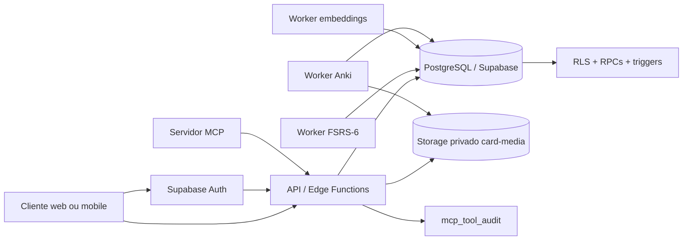

# Flashi

## Documentação técnica completa

O **Flashi** é a camada de dados de uma plataforma de flashcards com suporte a notas, múltiplos cartões por nota, repetição espaçada, estudo em vários dispositivos, mídia privada, busca semântica, interoperabilidade com Anki e integração futura com ferramentas MCP.

Este repositório contém o **schema PostgreSQL/Supabase**, as migrações incrementais, as políticas RLS, as funções transacionais, as Edge Functions de sincronização, revisão, embeddings, busca semântica, otimização FSRS e transferência Anki, além de validadores locais de sintaxe, tipos e contratos. O frontend, o materializador de templates e o adaptador MCP continuam sendo componentes externos que consumirão esses contratos.

> **Estado atual:** as migrações `0001` até `0023` estão versionadas. `0018_search_optimizer_anki_contracts`, `0019_fsrs_scheduler`, `0020_move_pg_net_registration`, `0021_ai_ingestion_occlusion_references`, `0022_harden_image_occlusion_grant` e `0023_security_definer_cleanup` já foram aplicadas no projeto Supabase `flashi`; o commit remoto de AI foi integrado sem reutilizar a numeração 0018 já aplicada. As funções `sync`, `fsrs-review`, `embeddings`, `semantic-search`, `fsrs-optimize`, `fsrs-optimize-worker`, `anki-transfer` e `ai-ingest` estão publicadas com JWT obrigatório. A busca semântica ainda depende de `OPENAI_API_KEY`; o worker FSRS exige um JWT com role `service_role` quando for acionado por cron; e a compatibilidade `.apkg` é deliberadamente limitada ao subconjunto implementado e testado neste README. O advisor de segurança remoto retorna zero lints após 0023.

## 1. Objetivos do sistema

O banco precisa resolver quatro problemas diferentes sem misturar suas responsabilidades. O primeiro é armazenar conteúdo: decks, notas, cartões, templates, tags e mídia. O segundo é armazenar o histórico de estudo por usuário, sem transformar o conteúdo compartilhado em estado global. O terceiro é garantir sincronização confiável entre dispositivos, inclusive quando uma exclusão ocorrer offline. O quarto é oferecer contratos seguros para automações, busca semântica, ingestão por IA, interoperabilidade com Anki e MCP.

A decisão central é separar **conteúdo** de **progresso de aprendizagem**. Uma nota representa o conteúdo original. Um cartão representa uma forma de estudar esse conteúdo. O estado FSRS ou SM-2 pertence ao par `(usuário, cartão)`, porque duas pessoas podem estudar o mesmo cartão com ritmos e históricos diferentes.

## 2. Escopo e responsabilidades

| Camada | Responsabilidade | Local previsto |
|---|---|---|
| PostgreSQL/Supabase | Persistência, integridade referencial, RLS, triggers, índices, RPCs e cursores de sincronização | Este repositório |
| Supabase Auth | Identidade, JWT e `auth.uid()` usado nas policies | Projeto Supabase |
| Supabase Storage | Arquivos de imagem, áudio, vídeo e outros anexos | Bucket privado `card-media` |
| Cliente web/mobile | Interface, cache local, fila offline, renderização de templates e envio autenticado | Projeto futuro |
| Worker FSRS-6 | Cálculo de agendamento e persistência idempotente de revisões | `supabase/functions/fsrs-review/` |
| Worker de embeddings | Geração, atualização e reprocessamento dos vetores semânticos | `supabase/functions/embeddings/` |
| Busca semântica | Embedding da consulta, filtros de ownership e chamada da RPC vetorial | `supabase/functions/semantic-search/` |
| Otimizador FSRS | Enfileiramento autenticado, claim, cálculo WASM e persistência de pesos | `supabase/functions/fsrs-optimize/` e `fsrs-optimize-worker/` |
| Worker Anki | Leitura/escrita ZIP, `collection.anki2`, modelos, tags e mídia | `supabase/functions/anki-transfer/` e `_shared/anki-apkg.ts` |
| Ingestão AI | Validação de fonte e criação de jobs para processamento assíncrono | `supabase/functions/ai-ingest/` |
| Oclusão de imagem | Caixas percentuais, cartões Cloze e estado de estudo | RPC `create_image_occlusion_note()` |
| Referências entre notas | Links direcionados entre notas do mesmo usuário | tabela `note_references` |
| Sincronização | Entrega incremental de alterações e tombstones com cursor monotônico | `supabase/functions/sync/` |
| Adaptador MCP | Transporte JSON-RPC, autenticação, validação de argumentos e exposição das ferramentas | Servidor MCP ou Edge Function |

A separação é deliberada. O banco não deve abrir arquivos ZIP, executar JavaScript de templates, chamar um modelo de embeddings, baixar PDF/YouTube/web ou falar diretamente o protocolo MCP. Ele deve oferecer transações pequenas, determinísticas e auditáveis para que esses serviços façam seu trabalho sem duplicar regras de segurança.

A Edge Function `ai-ingest` apenas autentica, valida a fonte e cria o job assíncrono. O worker de ingestão deve baixar ou processar o conteúdo, chamar o provedor de LLM com saída estruturada e materializar notas/cartões em uma transação. A RPC `create_image_occlusion_note()` materializa um cartão Cloze e seu estado de aprendizagem para cada caixa percentual pertencente a uma nota do usuário.

## 3. Arquitetura de alto nível



O cliente sempre opera com um usuário autenticado. As funções que fazem parte do fluxo de requisição usam `SECURITY INVOKER` quando precisam respeitar o RLS do usuário. As duas exceções principais são os triggers de USN e tombstone, que usam `SECURITY DEFINER` porque precisam atribuir um cursor confiável e registrar exclusões sem permitir que o cliente escolha o valor.

O RLS é uma camada de defesa em profundidade. No Supabase, tabelas expostas precisam ter RLS habilitado e policies explícitas; sem uma policy adequada, o acesso pela API não deve ser considerado permitido [1]. O Storage segue a mesma ideia por meio de policies na tabela `storage.objects` [2].

## 4. Estrutura do repositório

As migrações estão atualmente na raiz do projeto. Isso facilita a revisão do schema, mas o Supabase CLI normalmente espera arquivos dentro de `supabase/migrations/`. Antes de usar `supabase db push`, mova ou copie os arquivos para esse diretório, preservando a ordem e os nomes. Como alternativa, execute os scripts em sequência no SQL Editor, em um ambiente de homologação primeiro.

| Arquivo | Tipo | Função |
|---|---|---|
| `0001_types.sql` | Migração | Cria os enums de domínio. |
| `0002_profiles.sql` | Migração | Cria o perfil 1:1 com `auth.users`. |
| `0003_decks.sql` | Migração | Cria decks, subdecks e colaboradores. |
| `0004_tags_templates.sql` | Migração | Cria tags e templates de cartão. |
| `0005_cards_media.sql` | Migração | Cria cartões, relação de tags e metadados de mídia. |
| `0006_learning_reviews.sql` | Migração | Cria estado de aprendizagem e histórico de revisões. |
| `0007_settings_statistics.sql` | Migração | Cria configurações de estudo e estatísticas diárias. |
| `0008_triggers_functions.sql` | Migração | Cria triggers de timestamps, provisionamento e imutabilidade. |
| `0009_rls_policies.sql` | Migração | Habilita RLS e cria autorização das entidades originais. |
| `0010_views_rpc.sql` | Migração | Cria a árvore de decks e as RPCs de estudo. |
| `0011_storage.sql` | Migração | Cria o bucket privado e suas policies. |
| `0012_fsrs6_notes_embeddings.sql` | Migração | Separa notas e cartões, adiciona Cloze, FSRS-6 e pgvector. |
| `0013_incremental_sync_usn_graves.sql` | Migração | Adiciona USN global, tombstones e sincronização incremental. |
| `0014_interoperability_mcp.sql` | Migração | Adiciona provenance, jobs Anki, auditoria MCP e RPCs externas. |
| `0015_hardening_workers_contracts.sql` | Migração | Adiciona idempotência de revisões, integridade SHA-256, índices compostos, sync com ownership e limpeza de mídia órfã. |
| `0016_security_advisors_hardening.sql` | Migração | Corrige view SECURITY DEFINER, fixa search_path e remove execução pública de funções internas de trigger. |
| `0017_fix_rls_recursion_and_fk_indexes.sql` | Migração | Isola consultas de ownership/colaboração para evitar recursão RLS e cobre FKs sem índice. |
| `0018_search_optimizer_anki_contracts.sql` | Migração | Cria bucket privado de transferências, contratos de jobs FSRS e RPC de criação de jobs `.apkg`. |
| `0019_fsrs_scheduler.sql` | Migração | Habilita pg_cron/pg_net e define helper privado para agendar o worker com secret no Vault, sem armazenar JWT na migration. |
| `0020_move_pg_net_registration.sql` | Migração | Recria pg_net no schema `extensions` após verificar fila vazia e ausência de dependências externas, eliminando o lint `extension_in_public`. |
| `0021_ai_ingestion_occlusion_references.sql` | Migração | Adiciona fila de ingestão por IA, caixas de oclusão de imagem, referências cruzadas, RPC transacional de oclusão, USN/RLS e tombstones das novas entidades. |
| `0022_harden_image_occlusion_grant.sql` | Migração | Remove EXECUTE público da RPC SECURITY DEFINER de oclusão, mantendo acesso para `authenticated`. |
| `0023_security_definer_cleanup.sql` | Migração | Torna explícito o `search_path` do sync e troca a RPC de oclusão para `SECURITY INVOKER`, removendo lints evitáveis. |
| `0024_gamification_exams_socratic.sql` | Migração | Adiciona XP/níveis/badges, exames com priorização recursiva, remediação socrática de leeches, RLS, USN/graves e RPCs autenticadas. |
| `supabase/functions/` | Edge Functions | Implementa sincronização, revisão, embeddings, busca semântica, otimização FSRS, transferência Anki e enfileiramento AI em TypeScript/Deno. |
| `tests/fsrs_smoke.ts` | Teste local | Exercita o `fsrs-browser` WASM e confirma retorno de 21 parâmetros. |
| `tests/anki_roundtrip.ts` | Teste local | Exercita exportação/importação `.apkg`, tags, mídia e rejeição de zip-slip. |
| `validate_sql.py` | Ferramenta local | Faz parse PostgreSQL de todos os arquivos `00*.sql` usando `pglast`. |

## 5. Ordem de implantação e dependências

A ordem é obrigatória porque as migrações criam tipos, tabelas, funções e policies que dependem de objetos anteriores.

```text
0001_types
  -> 0002_profiles
  -> 0003_decks
  -> 0004_tags_templates
  -> 0005_cards_media
  -> 0006_learning_reviews
  -> 0007_settings_statistics
  -> 0008_triggers_functions
  -> 0009_rls_policies
  -> 0010_views_rpc
  -> 0011_storage
  -> 0012_fsrs6_notes_embeddings
  -> 0013_incremental_sync_usn_graves
  -> 0014_interoperability_mcp
  -> 0015_hardening_workers_contracts
  -> 0016_security_advisors_hardening
  -> 0017_fix_rls_recursion_and_fk_indexes
  -> 0018_search_optimizer_anki_contracts
  -> 0019_fsrs_scheduler
  -> 0020_move_pg_net_registration
  -> 0021_ai_ingestion_occlusion_references
      -> 0022_harden_image_occlusion_grant
      -> 0023_security_definer_cleanup
      -> 0024_gamification_exams_socratic

```

As migrações usam `create table if not exists`, `create index if not exists`, `drop policy if exists` e blocos `DO $$ ... $$` para tornar a aplicação repetível em bases que já receberam parte do schema. Idempotência não significa que uma migração possa ser executada fora de ordem. Ela significa que a mesma versão pode ser reaplicada com menor risco durante uma implantação controlada.

### 5.1 Procedimento recomendado

Em desenvolvimento, crie um projeto Supabase separado. Faça backup ou snapshot antes de aplicar `0012`, `0013`, `0014`, `0015`, `0016` ou `0017` em uma base com dados reais. Execute a validação local, aplique as migrações em ordem, faça uma sincronização completa de um dispositivo de teste e só depois habilite o cursor incremental.

```bash
# Na raiz do repositório
sudo pip3 install pglast
python3 validate_sql.py

git diff --check

# Depois de configurar o projeto Supabase e mover as migrações
supabase db push
```

A aplicação deve verificar a versão do schema. Um deploy que atualiza o cliente antes do banco pode falhar se o cliente chamar `record_review_fsrs6()` ou `get_incremental_sync()` antes da migração correspondente estar disponível.

## 6. Tipos e enums de domínio — `0001_types.sql`

A primeira migração cria os tipos compartilhados por várias tabelas. Ela não cria `pgcrypto`: `gen_random_uuid()` já está disponível na versão de PostgreSQL usada pelo Supabase, conforme a premissa registrada no próprio script.

| Tipo | Valores | Uso |
|---|---|---|
| `card_state` | `new`, `learning`, `review`, `relearning` | Estado operacional de um cartão para um usuário. |
| `review_rating` | `again`, `hard`, `good`, `easy` | Resposta do estudante em uma revisão. |
| `deck_visibility` | `private`, `shared`, `public` | Visibilidade do deck. |
| `srs_algorithm` | `sm2`, `fsrs`, `custom` | Algoritmo de agendamento persistido no estado e nas configurações. |
| `media_type` | `image`, `audio`, `video`, `other` | Tipo lógico do arquivo no Storage. |
| `collaborator_role` | `viewer`, `editor` | Permissão de colaborador em um deck compartilhado. |

Os valores dos enums são contratos de dados. Não altere ou remova um valor em produção sem antes atualizar o cliente, as RPCs, relatórios e filtros que dependem dele.

## 7. Identidade e perfil — `0002_profiles.sql`

A tabela `public.profiles` é uma extensão 1:1 de `auth.users`. O identificador do perfil é o próprio UUID do usuário autenticado. Ela armazena `display_name`, `avatar_url`, idioma, fuso horário e configurações livres em JSONB.

A criação efetiva do registro ocorre no trigger `trg_auth_user_created`, definido na migração `0008`. O trigger chama `handle_new_user()`, que cria o perfil e as configurações de estudo padrão. O uso de `on conflict do nothing` permite reprocessar o evento sem duplicar dados.

## 8. Decks e compartilhamento — `0003_decks.sql`

`public.decks` representa uma coleção hierárquica de estudo. A coluna `parent_deck_id` permite subdecks. O próprio deck não pode ser seu pai, e o índice único impede dois decks ativos com o mesmo nome, pertencentes ao mesmo usuário e sob o mesmo pai.

A coluna `visibility` possui três estados. `private` é o padrão. `shared` exige registros em `deck_collaborators`; o enum, sozinho, não concede acesso. `public` permite leitura pública conforme as policies da migração `0009`.

A tabela `deck_collaborators` usa chave primária composta `(deck_id, user_id)`. O dono administra os convites e o colaborador pode ler sua própria autorização. A role `viewer` não deve ser usada para escrita de conteúdo. A role `editor` pode ser usada pelo serviço de autorização para permitir edição, mas a policy atual deve ser revisada se o produto passar a aceitar edição real por colaboradores.

O soft delete é feito por `deleted_at`. Não há policy de `DELETE` para decks ou cartões. A função `soft_delete_deck()` marca o deck, seus subdecks diretos e os cartões associados. Essa escolha preserva histórico e permite que a sincronização emita tombstones.

## 9. Tags e templates — `0004_tags_templates.sql`

`public.tags` é uma tabela de tags pertencente a um usuário. O índice único `(user_id, name)` evita a mesma tag repetida para o mesmo proprietário.

`public.card_templates` descreve como um cartão deve ser renderizado. O template pode ser do usuário ou de sistema. `field_definitions` e `card_generation` são JSONB porque templates precisam evoluir sem exigir uma migração para cada novo tipo de campo ou regra de geração.

Antes da migração `0012`, o modelo usava `note_group_id` em cartões como uma aproximação de agrupamento. Esse valor não representa uma relação completa entre uma nota e seus cartões gerados. O modelo oficial passa a ser `notes` mais `note_card_definitions`, com `cards.note_id` obrigatório.

## 10. Cartões, tags e mídia — `0005_cards_media.sql`

`public.cards` é o exercício de estudo. Ele pertence a um deck, possui um template, mantém seus campos flexíveis em `fields` e registra flags de suspensão, arquivamento e soft delete. A migração original também cria índices por usuário, deck, grupo de nota e conteúdo JSONB.

`public.card_tags` é uma tabela de junção com chave primária composta `(card_id, tag_id)`. A relação é simples e evita duplicação de tags no JSON do cartão.

`public.card_media` armazena apenas metadados e o ponteiro para o Storage. Os bytes não ficam no PostgreSQL. Os campos principais são `storage_path`, `media_type`, `mime_type`, tamanho e metadados JSONB. A migração `0012` acrescenta `md5_hash` e `storage_bucket`; a migração `0015` acrescenta `sha256_hash`, permitindo verificar a integridade do arquivo no worker de upload ou importação sem confundir o algoritmo do digest.

## 11. Estado de estudo e histórico — `0006_learning_reviews.sql`

`public.card_learning_state` mantém uma linha por `(user_id, card_id)`. O conteúdo do cartão pode ser compartilhado, mas esse estado é sempre individual. Ele registra estado, datas, intervalo, fator de facilidade, estabilidade, dificuldade, contadores, suspensão, algoritmo e um `algorithm_state` JSONB para dados específicos.

O índice parcial `idx_learning_due` prioriza a fila de cartões cujo `due_at` chegou e que não estão suspensos. A fila não depende de uma varredura de `review_logs`, portanto o crescimento do histórico não deve degradar diretamente a consulta de cartões pendentes.

`public.review_logs` é o histórico append-only. Cada linha registra usuário, cartão, rating, horário, dados anteriores e posteriores, tempo de estudo, intervalo, estabilidade, dificuldade, dispositivo, sessão e algoritmo. Não há UPDATE ou DELETE autorizado por RLS. O trigger `prevent_review_log_mutation()` também rejeita mutações diretas, criando uma segunda barreira contra alteração acidental.

Em volumes muito altos, o próximo passo é particionar `review_logs` por período de `reviewed_at`. Isso não faz parte das migrações atuais porque particionamento adiciona custo operacional e não deve ser introduzido sem métricas reais.

## 12. Configurações e estatísticas — `0007_settings_statistics.sql`

`public.study_settings` mantém os parâmetros globais do usuário: limites de cartões novos e de revisão, etapas de aprendizagem e relearning, intervalos de graduação, ease inicial, parâmetros FSRS, hora de início do dia e timezone operacional.

`public.user_deck_settings` contém substituições por usuário e deck. O JSONB `overrides` permite ajustar limites ou preferências sem duplicar a configuração global.

`public.daily_statistics` é a fonte de verdade para contadores por dia. Ela registra cartões estudados, novos cartões, revisões, acertos, erros e tempo de estudo. O streak não é armazenado como uma coluna acumulada; `get_current_streak()` calcula a sequência de dias consecutivos a partir dessas estatísticas.

## 13. Triggers e funções de infraestrutura — `0008_triggers_functions.sql`

A função `set_updated_at()` atualiza `updated_at` antes de alterações em perfis, decks, templates, cartões, estados de aprendizagem, configurações de estudo e configurações por deck.

A função `handle_new_user()` é `SECURITY DEFINER` com `search_path` controlado. Ela cria `profiles` e `study_settings` no evento de inserção em `auth.users`. O objetivo é que o restante do sistema possa assumir que um usuário novo tem uma configuração básica.

A função `prevent_review_log_mutation()` lança uma exceção em qualquer `UPDATE` ou `DELETE` de `review_logs`. A imutabilidade é uma regra de auditoria, não apenas uma conveniência da aplicação.

## 14. Row Level Security — `0009_rls_policies.sql`

As policies são organizadas por ownership e visibilidade. Registros pessoais usam `auth.uid() = user_id` ou `auth.uid() = id`. Decks e cartões públicos possuem leitura adicional. Decks compartilhados consultam `deck_collaborators`. Templates de sistema podem ser lidos, mas não editados por usuários comuns.

| Entidade | Leitura | Escrita | Exclusão |
|---|---|---|---|
| `profiles` | Próprio perfil | Próprio perfil | Controlada pelo Auth |
| `decks` | Dono, público ou colaborador conforme a policy | Dono | Soft delete via RPC |
| `deck_collaborators` | Dono e próprio colaborador | Dono | Dono |
| `tags` | Dono | Dono | Dono |
| `card_templates` | Dono e templates de sistema | Dono | Dono |
| `cards` | Dono, público ou compartilhado | Dono | Soft delete via RPC |
| `card_tags` | Dono do cartão | Dono | Dono |
| `card_media` | Dono | Dono | Dono |
| `card_learning_state` | Próprio usuário | Próprio usuário | Próprio usuário |
| `review_logs` | Próprio usuário | Insert próprio | Bloqueada |
| `study_settings` | Próprio usuário | Próprio usuário | Próprio usuário |
| `user_deck_settings` | Próprio usuário | Próprio usuário | Próprio usuário |
| `daily_statistics` | Próprio usuário | Próprio usuário | Próprio usuário |

A RLS não substitui a validação da aplicação. O adaptador MCP, os workers e o cliente devem validar payloads antes de chamar uma RPC. A RLS garante que uma chamada autenticada não atravesse a fronteira de ownership definida no banco.

## 15. Views e RPCs de estudo — `0010_views_rpc.sql`

A view recursiva `v_deck_tree` entrega a hierarquia de decks para a interface. Ela deve ser consumida respeitando as policies das tabelas de origem.

A função `get_due_cards(p_deck_id, p_limit)` monta a fila de estudo. Ela considera cartões novos e cartões vencidos, limites de configuração global e limites diários já registrados em `daily_statistics`. A consulta usa o estado por usuário e o índice parcial de vencimento.

A função legada `record_review()` recebe o resultado calculado pela aplicação e grava, em uma única operação, o log, o novo estado do cartão e os agregados diários. O agendamento não é calculado no SQL. Essa função continua útil para compatibilidade SM-2 ou fluxos anteriores. Para o fluxo FSRS-6, o cliente deve preferir a Edge Function `fsrs-review`, que usa `ts-fsrs` e chama `record_review_fsrs6_idempotent()` com uma chave estável por revisão.

A função `get_current_streak()` percorre as estatísticas diárias para encontrar a sequência atual. A função `soft_delete_deck()` realiza o soft delete do deck, subdecks e cartões relacionados.

Exemplo de fila:

```sql
select *
from public.get_due_cards(
  p_deck_id := null,
  p_limit := 30
);
```

## 16. Storage privado — `0011_storage.sql`

A migração cria o bucket privado `card-media`. O caminho precisa começar com o UUID do usuário:

```text
{user_id}/{card_id}/{asset_id}.{extension}
```

As policies da tabela `storage.objects` permitem `SELECT`, `INSERT` e `DELETE` somente quando o bucket é `card-media` e a primeira pasta é igual a `auth.uid()`. A aplicação deve gerar o caminho no servidor ou validar o caminho antes do upload. Não use URLs públicas permanentes para essa mídia.

A coluna `card_media.storage_path` deve conter o caminho relativo ao bucket. O worker deve salvar o digest SHA-256 em `sha256_hash` depois de concluir o upload; `md5_hash` permanece apenas como metadado legado da migração `0012`. Um digest diferente indica arquivo corrompido, reenvio incompleto ou colisão de referência e deve ser tratado como erro de integridade.

## 17. Notas, múltiplos cartões, Cloze, FSRS-6 e embeddings — `0012_fsrs6_notes_embeddings.sql`

Esta é a primeira grande migração estrutural. Ela transforma o agrupamento informal de cartões em uma relação explícita entre nota e cartão.

### 17.1 Separação nota-cartão

A tabela `public.notes` guarda os campos originais em `fields`, tags, deck de origem, metadados de edição, soft delete e o vetor semântico opcional. Cada cartão passa a ter `note_id` obrigatório. O backfill cria uma nota para cada `note_group_id` histórico e atualiza os cartões existentes.

A tabela `note_card_definitions` registra como uma nota gera cartões. Ela suporta `basic`, `reverse` e `cloze`, além de ordem, nome, template e dados JSONB da definição. Templates de sistema podem ser consultados, mas só o dono do template pode inserir, atualizar ou excluir definições.

A aplicação deve tratar a nota como fonte original. Quando uma definição mudar, o worker de materialização decide se cria, atualiza, suspende ou remove cartões. O SQL não executa o renderizador do template.

### 17.2 Omissões Cloze

`note_cloze_deletions` registra cada omissão com `cloze_ordinal`, texto, posição opcional e metadados. Uma nota pode ter várias omissões. Cada omissão pode gerar um cartão independente, permitindo suspender `c1` sem suspender `c2`.

O cliente deve impedir ordinais duplicados para a mesma nota e deve reconstruir a exibição Cloze a partir da nota original mais a definição da omissão. O texto final não deve ser duplicado em todas as linhas de cartão.

### 17.3 Persistência FSRS-6

O FSRS deve ser executado na camada de aplicação. A documentação oficial do projeto separa habilitação, configuração, otimização, avaliação e agendamento customizado; o optimizer depende de um histórico consistente de revisões [4].

A migração adiciona a versão do FSRS, retenção desejada, pesos, data da última otimização e contadores em `study_settings`. No estado do cartão, ela adiciona valores persistidos de estabilidade, dificuldade, retratabilidade, dias transcorridos, dias agendados e estado FSRS. Os logs preservam os valores anteriores e posteriores para auditoria e reprocessamento.

O fluxo normal é:

```text
1. A Edge Function `fsrs-review` lê o estado atual do cartão e as configurações do usuário.
2. O worker calcula o próximo estado com `ts-fsrs` e o horário do servidor.
3. A função chama `record_review_fsrs6_idempotent()` usando `client_review_id`.
4. A RPC bloqueia a linha do estado, valida ownership e deduplica retries.
5. RPC insere review_logs.
6. RPC atualiza card_learning_state.
7. RPC incrementa daily_statistics.
8. RPC confirma tudo na mesma transação.
```

Exemplo:

```sql
select public.record_review_fsrs6(
  p_card_id := '00000000-0000-0000-0000-000000000000',
  p_rating := 'good',
  p_time_spent_ms := 4200,
  p_new_state := 'review',
  p_new_interval_days := 6,
  p_new_due_at := now() + interval '6 days',
  p_fsrs_state := 2,
  p_fsrs_step := null,
  p_fsrs_retrievability := 0.91,
  p_elapsed_days := 5,
  p_scheduled_days := 6,
  p_new_stability := 5.8,
  p_new_difficulty := 4.1
);
```

A RPC não deve aceitar que o cliente escolha `user_id`, `usn`, `reviewed_at` de outro usuário ou valores de auditoria que pertençam ao servidor. O usuário é derivado de `auth.uid()`.

### 17.4 Otimização individual

`fsrs_optimization_runs` é uma fila persistente. `enqueue_fsrs_optimization()` não executa machine learning durante a requisição; ela cria uma execução quando o usuário possui revisões suficientes e não há outra execução `queued` ou `running`.

O worker deve:

1. Ler os logs FSRS do usuário.
2. Validar o conjunto de dados e sua ordem temporal.
3. Executar uma versão fixa e identificável do optimizer.
4. Salvar os pesos, a versão do algoritmo e métricas.
5. Atualizar `study_settings.fsrs_weights` somente após sucesso.
6. Marcar o job como `completed` ou `failed` com mensagem segura.

`get_fsrs_optimization_status()` retorna contagem de revisões, limiar, existência de job pendente e data da última otimização. O produto deve exibir esse estado de forma clara e nunca afirmar que os pesos foram personalizados se o worker não concluiu a execução.

### 17.5 Busca semântica com pgvector

A coluna `notes.embedding` usa `extensions.vector(1536)`. A extensão PostgreSQL se chama `vector`, e o padrão de usar `extensions.vector(n)` é compatível com a documentação do Supabase [3]. O índice HNSW acelera busca aproximada por distância cosseno. O projeto upstream do pgvector documenta as operações de distância e as características do HNSW [7].

Os embeddings são gerados fora do banco. O worker deve armazenar o modelo, a dimensão, a versão do pipeline e o momento de geração. Se o modelo mudar, não misture vetores de dimensões ou espaços incompatíveis; reprocesse as notas com uma versão nova.

As RPCs `search_notes_by_embedding()` e `find_similar_notes()` aplicam RLS e filtram por usuário, deck ou exclusão lógica. Em consultas vetoriais com filtro adicional, o cliente deve aceitar que um índice aproximado pode retornar menos itens que o limite nominal; a documentação do Supabase recomenda atenção especial a esse caso [3].

Exemplo conceitual:

```sql
select *
from public.search_notes_by_embedding(
  p_query_embedding := '[0.01, 0.02, ...]'::extensions.vector,
  p_limit := 20,
  p_deck_id := null
);
```

## 18. Sincronização incremental e tombstones — `0013_incremental_sync_usn_graves.sql`

A sincronização usa um **USN global atribuído pelo servidor**. A sequence `sync_usn_seq` fornece valores monotônicos. As entidades sincronizáveis recebem uma coluna `usn` e triggers que atribuem um novo valor em insert ou update.

As principais entidades cobertas são `decks`, `cards`, `notes`, `card_templates`, `tags`, `card_media`, `card_learning_state`, `review_logs`, `study_settings`, `user_deck_settings`, `daily_statistics`, `note_card_definitions`, `note_cloze_deletions`, `fsrs_optimization_runs` e `card_tags`. A função `get_incremental_sync()` filtra as linhas ativas por ownership do usuário autenticado; a migração `0015` também garante que tombstones sejam entregues apenas ao respectivo proprietário.

A tabela `graves` é o registro de exclusões. Ela guarda usuário, tipo da entidade, chave da entidade, USN, momento de exclusão e metadados. Para tabelas com chave composta, como `card_tags`, a chave é serializada de modo determinístico. Uma exclusão lógica também produz grave quando `deleted_at` muda de nulo para uma data.

Os triggers `assign_sync_usn()` e `record_sync_grave()` são `SECURITY DEFINER`. Isso evita que um cliente forge o cursor. A função `get_incremental_sync(p_after_usn, p_limit)` devolve alterações ativas e tombstones posteriores ao cursor, ordenados por USN. A Edge Function `sync` limita o payload, serializa o cursor como texto para evitar perda de precisão em clientes JavaScript e retorna `next_usn` e `has_more`.

Exemplo:

```sql
select *
from public.get_incremental_sync(
  p_after_usn := 0,
  p_limit := 500
);
```

O cliente deve aplicar o lote inteiro antes de gravar o novo cursor. A sequência segura é:

```text
1. Enviar o último USN confirmado.
2. Receber alterações e graves em ordem crescente.
3. Aplicar upserts de registros ativos.
4. Aplicar exclusões recebidas em graves.
5. Confirmar que o lote local foi persistido.
6. Gravar o maior USN do lote.
```

Se uma etapa falhar, o cliente deve repetir o mesmo cursor. Upserts e exclusões precisam ser idempotentes. Nunca avance o cursor antes de aplicar todos os itens do lote.

O USN não é um mecanismo de resolução de todos os conflitos. Ele ordena alterações no servidor. Para edições de conteúdo concorrentes, o produto ainda precisa definir uma política, como last-write-wins por `updated_at`, revisão explícita ou merge por campo. Logs de revisão são eventos append-only e podem ser reenviados com UUID idempotente.

## 19. Gamificação, exames e remediação socrática — `0024_gamification_exams_socratic.sql`

A migração `0024_gamification_exams_socratic.sql` implementa apenas as três lacunas reais solicitadas. A gamificação separa o perfil de XP (`user_gamification_profiles`), o catálogo (`badges_definition`) e os desbloqueios (`user_badges`), com a RPC transacional `add_user_xp(uuid, integer)` e fórmula de nível documentada na API. O agendador usa `deck_exams`, aceita os quatro valores de `exam_priority_level`, percorre subdecks com `WITH RECURSIVE` e expõe `get_due_cards_with_exam_schedule(uuid, integer)`, preservando as cotas de `study_settings` e `daily_statistics` de `get_due_cards`. A remediação socrática cria `socratic_remediation_sessions` quando o cartão cruza `lapses >= 4`, marca `is_suspended = true` sem inventar um valor `suspended` em `card_state`, e conclui o fluxo com `resolve_socratic_remediation(uuid)`.

As cinco tabelas novas têm RLS habilitado. O catálogo de badges permite leitura pública; todas as relações de usuário são ownership-scoped. As tabelas sincronizáveis recebem USN e triggers de tombstone, e `get_incremental_sync()` inclui `user_gamification_profile`, `user_badge`, `deck_exam` e `socratic_remediation_session`. O contrato completo, com exemplos `supabase-js`, REST, payloads, erros e diagnóstico, está em [`docs/SUPABASE_API.md`](docs/SUPABASE_API.md).

## 20. Edge Functions implementadas

A pasta `supabase/functions/` usa TypeScript no runtime Deno, conforme o modelo de execução das Edge Functions do Supabase [10]. O import map fixa `@supabase/supabase-js@2.112.4`, `ts-fsrs@5.4.1`, `fflate@0.8.3`, `@sqlite.org/sqlite-wasm@3.53.0-build1` e `fsrs-browser@6.6.0`. O type-check estrito deve ser executado antes de qualquer publicação.

| Função | Autorização | Entrada principal | Saída principal | Dependências críticas |
|---|---|---|---|---|
| `sync` | JWT de usuário | `last_usn`, `limit` | alterações, graves, `next_usn`, `has_more` | RPC `get_incremental_sync()` |
| `fsrs-review` | JWT de usuário | `card_id`, `rating`, `client_review_id`, tempo | novo estado FSRS e confirmação idempotente | `ts-fsrs`, `record_review_fsrs6_idempotent()` |
| `embeddings` | JWT de usuário | `note_id` | modelo, dimensão, hash e status | `OPENAI_API_KEY` |
| `semantic-search` | JWT de usuário | `query`, `limit`, `mode`, `request_id` | resultados da RPC MCP e metadados do embedding | `OPENAI_API_KEY` para modo semântico |
| `fsrs-optimize` | JWT de usuário | `mode=request` ou `mode=run`, `run_id` | job enfileirado ou pesos calculados | `fsrs-browser` WASM |
| `fsrs-optimize-worker` | JWT válido com claim `role=service_role` | opcionalmente `run_id`, `limit` | lista de jobs processados | `SUPABASE_SERVICE_ROLE_KEY` e jobs 0018 |
| `anki-transfer` | JWT de usuário | `action=import/export` e path ou deck | job concluído, contadores e path do `.apkg` | ZIP, SQLite WASM e Storage privado |
| `ai-ingest` | JWT de usuário | `deck_id`, `source_type`, `content` ou `storage_path` | `job_id` em estado `queued` | fila `ai_ingestion_jobs` |

As funções de usuário usam `createUserClient(request)`: o JWT é encaminhado ao Supabase e o banco deriva `auth.uid()`, preservando RLS. Nenhuma função de usuário precisa de `service_role`. O worker FSRS usa credencial de serviço apenas no servidor e rejeita tokens com role diferente de `service_role`; manter `verify_jwt=true` impede chamadas sem JWT válido antes desse guard adicional.

### 19.1 Busca semântica completa

`semantic-search` aceita `mode: "semantic"` por padrão e `mode: "lexical"` como fallback explícito. No modo semântico, ele valida `query` com no máximo 8.000 caracteres, chama `POST https://api.openai.com/v1/embeddings` com `text-embedding-3-small`, exige exatamente 1.536 números finitos, calcula o hash SHA-256 da query e chama `mcp_search_notes()` com o vetor. O modo lexical não chama o provedor externo e é útil para disponibilidade degradada, testes e migrações.

```json
{
  "query": "funções de ordem superior em TypeScript",
  "limit": 20,
  "mode": "semantic",
  "request_id": "search-uuid-estavel"
}
```

A resposta contém `mode`, `model`, `dimensions`, `query_hash` e `results`. Os resultados respeitam os filtros da RPC e nunca expõem o vetor cru como parte do contrato de interface. A ausência de `OPENAI_API_KEY` produz erro de configuração (`503`) para o modo semântico; isso não é mascarado como busca lexical automática, porque ocultar a falha dificultaria a observabilidade.

### 19.2 Otimização FSRS personalizada

`POST /functions/v1/fsrs-optimize` sem `mode` ou com `mode: "request"` chama `enqueue_fsrs_optimization()` e retorna `202` com `run_id`. O job só é criado se a RPC considerar o histórico elegível e não houver outra execução pendente. Para execução manual autenticada do próprio usuário, envie `mode: "run"` e o `run_id`; o endpoint faz claim, lê no máximo 25.000 logs FSRS, agrupa-os por cartão em ordem temporal, executa o `fsrs-browser` WASM e grava exatamente 21 pesos por meio de uma RPC transacional.

```json
{
  "mode": "request"
}
```

A execução periódica é feita pelo endpoint `fsrs-optimize-worker`. Ele consulta jobs `queued`, faz claim atômico via `claim_fsrs_optimization_job_for_worker()`, limita cada chamada a cinco jobs, atualiza `study_settings` somente após o cálculo bem-sucedido e marca falhas com mensagem truncada. O worker não aceita a chave pública `anon`: mesmo que o gateway aceite o JWT anônimo, o claim `role` é rejeitado.

O pacote WASM foi validado no Deno local e no Edge Runtime remoto após corrigir a dependência de `self` usada por `wasm-bindgen-rayon`. O cálculo hoje grava `old_loss` e `new_loss` como nulos, pois a chamada implementada não coleta métrica de validação independente; o produto não deve exibir uma melhoria de loss como se tivesse sido medida. O conjunto mínimo operacional é de dois logs válidos, embora a qualidade estatística dependa de um histórico muito maior e representativo.

### 19.3 Segredos e configuração

Configure secrets somente no Dashboard/CLI seguro do Supabase. Os nomes usados por estas funções são:

| Secret/configuração | Usado por | Obrigatório para | Nunca fazer |
|---|---|---|---|
| `SUPABASE_URL` | todas as funções | qualquer chamada autenticada | versionar em arquivo de produção |
| `SUPABASE_ANON_KEY` | funções de usuário | `createUserClient()` | substituir por service role no frontend |
| `SUPABASE_SERVICE_ROLE_KEY` | worker FSRS | execução de jobs periódicos | enviar ao cliente ou ao GitHub |
| `OPENAI_API_KEY` | `embeddings`, `semantic-search` | geração de vetores | registrar em logs ou README |
| `EMBEDDING_MODEL` | embeddings/busca | opcional; padrão `text-embedding-3-small` | usar modelo com dimensão diferente de 1.536 |

As chaves públicas podem estar no cliente, mas a `service_role` e a chave do provedor de embeddings não. O repositório contém apenas nomes de variáveis e placeholders conceituais.

## 20. Interoperabilidade Anki — migrações `0014` e `0018`

Um pacote `.apkg` é tratado como um ZIP não confiável que contém uma coleção SQLite, modelos, notas, cartões e, opcionalmente, mídia. O manual do Anki confirma que o formato pode incluir decks, notas, tipos de nota, cartões e dados de agendamento [5]. O Flashi não executa ZIP ou SQL no PostgreSQL: a Edge Function `anki-transfer` faz a validação e a conversão em memória, enquanto o Storage mantém os binários em bucket privado.

### 20.1 Máquina de estados e armazenamento

A tabela `anki_transfer_jobs` registra `import` ou `export`, usuário, path, SHA-256, status, contadores, erro limitado, opções e timestamps. O fluxo esperado é `queued -> running -> completed` ou `queued -> running -> failed`. A função `create_anki_transfer_job()` valida que o path é do usuário autenticado e está sob `{user_id}/imports/` ou `{user_id}/exports/`, sempre com extensão `.apkg`.

O bucket `anki-transfers` criado em `0018` é privado. As policies da tabela `storage.objects` permitem acesso somente quando a primeira pasta do path é o UUID do usuário. O cliente pode fazer upload de um arquivo para `user_id/imports/nome.apkg`; não pode usar o bucket para ler ou escrever o path de outro usuário. O arquivo processado nunca deve ser transformado em URL pública permanente.

| Limite implementado | Valor | Comportamento |
|---|---:|---|
| Tamanho máximo do pacote | 50 MiB | rejeita com `413` antes do parse/import |
| Entradas ZIP | 20.000 | rejeita paths/arquivos excessivos |
| Notas importadas | 10.000 | rejeita acima do limite |
| Mídias vinculadas por job | 2.000 | rejeita antes de continuar o upload |
| Tamanho do request JSON | 2 MiB na função Anki | rejeita payload de controle excessivo |
| IDs e nomes | UUIDs/strings limitadas | impede path traversal e nomes arbitrários |

### 20.2 Importação

O cliente primeiro envia o binário para `anki-transfers`, depois chama a função:

```json
{
  "action": "import",
  "storage_path": "<user_id>/imports/meu-deck.apkg",
  "target_deck_name": "Anki importado"
}
```

A função baixa o arquivo pelo path já validado, calcula o SHA-256 e usa `create_anki_transfer_job()`. Se o mesmo usuário já importou a combinação de direção e hash, o índice único permite retornar o job concluído em vez de criar uma segunda importação. Para arquivos novos, a função marca o job como `running`, lê a coleção SQLite e grava notas, definições, cartões e tags com provenance `source_format = 'anki_apkg'`, `external_id = 'anki:<nid>'` e `content_hash` calculado pelo Flashi.

O parser aceita `collection.anki2` e `collection.anki21`. O formato binário `collection.anki21b` é rejeitado claramente porque não é convertido silenciosamente. O leitor reconstrói campos conforme os modelos e templates encontrados, processa condicionais básicas, `{{FrontSide}}`, referências de campos e Cloze simples, e cria uma definição por cartão encontrado. Quando um template não produz cartões, usa fallback Basic com os campos disponíveis.

Tags são normalizadas para o usuário autenticado e vinculadas aos cartões importados. Mídia só é copiada quando seu nome aparece em algum campo da nota; cada arquivo recebe path isolado no bucket `card-media`, MIME derivado de extensão, tamanho e metadata com o nome original e a chave numérica do arquivo Anki. Não se executa JavaScript, CSS ou HTML importado como código do servidor; o frontend deve sanitizar/renderizar conteúdo conforme sua própria política.

A resposta concluída inclui `job_id`, deck de destino, `total_notes`, `imported_notes`, `imported_cards`, `skipped_notes` e `uploaded_media`. Uma falha depois de algumas notas pode deixar conteúdo parcial, mas o job termina como `failed` e registra uma mensagem limitada; o produto pode oferecer limpeza/reprocessamento por job como etapa futura.

### 20.3 Exportação

Para exportar um deck, envie um UUID de deck pertencente ao usuário:

```json
{
  "action": "export",
  "deck_id": "00000000-0000-4000-8000-000000000000",
  "include_media": true
}
```

A função valida ownership, cria um job `export`, lê até 10.000 cartões ativos, copia tags relacionadas, baixa mídia quando `include_media` é verdadeiro e gera um ZIP com `fflate` e `collection.anki2` em SQLite WASM. O resultado é salvo em `<user_id>/exports/<job_id>.apkg`; a resposta inclui path, SHA-256, número de cartões e tamanho em bytes. Quando `include_media` é falso, nenhum byte de `card-media` é baixado ou inserido no pacote.

O exportador atual cria deliberadamente um modelo Basic compatível, com campos `Front` e `Back`, uma nota por cartão, um deck derivado do deck Flashi, tags e o mapa `media`. Ele não preserva scheduling, intervalos, estados FSRS/SM-2, revlogs, múltiplos modelos originais, CSS avançado ou todos os metadados do Anki. A tabela `revlog` gerada não contém eventos de revisão. Portanto, esta é uma transferência de conteúdo e não uma promessa de round-trip completo com preservação de histórico. A paridade deve ser ampliada somente com fixtures reais do Anki e testes de importação no próprio Anki.

### 20.4 Segurança e recuperação

O parser rejeita paths absolutos, `../` e `..\\`, limita entradas, valida a existência da coleção e fecha a conexão SQLite em `finally`. O exportador sanitiza nomes de mídia, usa paths derivados de UUIDs conhecidos e impõe o mesmo limite de 50 MiB antes do upload. Nunca se deve aceitar um path fornecido pelo cliente fora do prefixo do próprio usuário, usar `upsert` em um path de outro job ou registrar o conteúdo do pacote nos logs.

A fila pode ser reprocessada consultando jobs `failed` e removendo/reutilizando os arquivos sob o prefixo do usuário. Uma rotina de limpeza deve considerar retenção para exports antigos, jobs órfãos e arquivos de importação já processados. A criação do job é idempotente por hash, mas a criação de conteúdo importado é deliberadamente auditada por `external_id`; o operador deve testar o comportamento de duplicatas antes de habilitar reprocessamento automático.

## 21. MCP — segunda parte de `0014_interoperability_mcp.sql`

O Model Context Protocol separa host, cliente e servidor e usa uma camada de dados baseada em JSON-RPC, além de uma camada de transporte. O protocolo define primitives como tools, resources e prompts, mas não define como a aplicação de IA deve usar o contexto [6]. No Flashi, o banco implementa somente contratos de dados seguros; o transporte MCP fica no adaptador.

A tabela `mcp_tool_audit` registra request id, usuário, nome da ferramenta, entrada sanitizada, resultado resumido, latência, status e timestamps. O log não deve armazenar tokens, segredos, conteúdo sensível desnecessário ou o texto integral de um prompt quando isso não for necessário para auditoria.

### 21.1 `mcp_create_note()`

A RPC cria uma nota e seus cartões em uma fronteira transacional. Ela valida o deck, cria a nota, materializa as definições enviadas e inicializa o estado de aprendizagem dos cartões gerados. Se `p_card_definitions` estiver vazio, a função cria um cartão Basic usando os campos `Front` e `Back` quando disponíveis.

A assinatura lógica inclui deck, campos JSONB, template opcional, lista JSONB de definições, provenance e `request_id`. O resultado contém o UUID da nota e a lista de cartões criados. O `request_id` deve ser reutilizável para investigar retries no log de auditoria.

### 21.2 `mcp_search_notes()`

A RPC recebe texto e, opcionalmente, um embedding. Quando há vetor, tenta busca semântica. Quando a busca vetorial não é possível ou não encontra resultado suficiente, usa uma estratégia lexical de fallback. A função respeita RLS, limita o número de resultados e registra a chamada em `mcp_tool_audit`.

O adaptador MCP deve autenticar o usuário antes de chamar a RPC, validar o schema dos argumentos e nunca entregar `service_role` a um agente. O servidor MCP também deve limitar taxa, tamanho de entrada e número de resultados.

### 21.3 `record_review_fsrs6()`

A RPC é o contrato de escrita para revisões FSRS-6. Ela recebe o resultado calculado pelo worker e grava log, estado e estatística em uma única transação. A linha do estado é bloqueada durante a operação para evitar que dois retries concorrentes sobrescrevam o mesmo estado sem coordenação.

O cálculo matemático fica fora da RPC para permitir atualização versionada do scheduler, testes determinísticos e execução assíncrona. A função persiste a versão e os dados suficientes para reproduzir ou auditar o resultado.

## 22. Modelo de dados consolidado

| Tabela | Papel | Chave principal | Propriedade | Soft delete |
|---|---|---|---|---|
| `profiles` | Perfil do usuário | `id` | Usuário | Não |
| `decks` | Coleção hierárquica | `id` | Usuário | Sim |
| `deck_collaborators` | Grants de compartilhamento | `(deck_id, user_id)` | Deck/usuário | Não |
| `tags` | Tags pessoais | `id` | Usuário | Não |
| `card_templates` | Formato de cartões | `id` | Usuário ou sistema | Não |
| `cards` | Exercícios gerados | `id` | Usuário/deck | Sim |
| `card_tags` | Junção cartão-tag | `(card_id, tag_id)` | Herda do cartão | Não |
| `card_media` | Referências de arquivos | `id` | Usuário/cartão | Não |
| `card_learning_state` | Estado por usuário | `(user_id, card_id)` | Usuário | Não |
| `review_logs` | Auditoria de revisões | `id` | Usuário | Não; append-only |
| `study_settings` | Configuração global | `user_id` | Usuário | Não |
| `user_deck_settings` | Overrides por deck | `(user_id, deck_id)` | Usuário | Não |
| `daily_statistics` | Agregados diários | `(user_id, stat_date)` | Usuário | Não |
| `notes` | Conteúdo original | `id` | Usuário/deck | Sim |
| `note_card_definitions` | Regras de geração | `id` | Dono do template | Não |
| `note_cloze_deletions` | Omissões Cloze | `id` | Nota | Não |
| `fsrs_optimization_runs` | Jobs de otimização | `id` | Usuário | Não |
| `graves` | Tombstones de sync | `id` | Usuário | Registro de exclusão |
| `anki_transfer_jobs` | Jobs `.apkg` | `id` | Usuário | Não |
| `mcp_tool_audit` | Auditoria de ferramentas | `id` | Usuário | Não |
| `ai_ingestion_jobs` | Fila de ingestão por IA | `id` | Usuário/deck | Sim |
| `note_image_occlusion_boxes` | Caixas de oclusão | `id` | Nota | Não |
| `note_references` | Referências direcionadas entre notas | `id` | Nota de origem | Não |

### 22.1 Ingestão por IA, oclusão e referências

A função `ai-ingest` autentica o usuário, valida o deck pertencente a ele, aceita `source_type` entre `pdf_document`, `youtube_url`, `raw_text_block` e `web_page`, e cria um job `queued` em `ai_ingestion_jobs`. O endpoint não faz download, OCR, transcrição ou chamada de LLM; essas etapas ficam em worker assíncrono. O limite de entrada declarado para PDF é 15 MiB e `source_reference` é limitado a 2.000 caracteres.

```json
{
  "deck_id": "00000000-0000-4000-8000-000000000000",
  "source_type": "raw_text_block",
  "content": "Texto de estudo a ser transformado em notas"
}
```

O worker futuro deve fazer claim atômico, baixar somente paths pertencentes ao usuário, gerar saída estruturada, materializar notas e cartões em uma transação e finalizar o job como `completed` ou `failed`. O contrato está em `supabase/functions/ai-ingest/WORKER_CONTRACT.md`; credenciais de LLM, PDF/YouTube/web e processamento pesado não estão embutidos na Edge Function. Jobs presos em `processing` precisam de timeout/recovery administrativo antes de qualquer retry automático.

A RPC `create_image_occlusion_note(p_note_id, p_boxes)` aceita caixas em percentuais dentro de 0 a 100, exige ownership da nota, persiste uma caixa por `cloze_ordinal`, cria um cartão Cloze e inicializa seu `card_learning_state`. Cada caixa retorna `card_id` e `cloze_ordinal`. A tabela `note_references` representa um link direcionado entre `source_note_id` e `target_note_id`, rejeita auto-referência e autoriza o acesso pela nota de origem. As três entidades novas possuem RLS e entram no sistema de USN/tombstones da migration 0021. A migration 0022 restringe a RPC SECURITY DEFINER de materialização ao papel `authenticated`, removendo EXECUTE público desnecessário.

## 23. Índices principais

| Índice ou grupo | Objetivo |
|---|---|
| Deck por usuário e pai | Renderizar árvore e validar nomes únicos. |
| Cartão por usuário, deck e grupo histórico | Preservar consultas legadas e a migração de notas. |
| GIN em `cards.fields` | Busca estrutural em campos JSONB existentes. |
| `idx_learning_due` | Montar fila de cartões vencidos sem varrer o histórico. |
| Estado por `(user_id, state)` | Filtrar cartões por estado de aprendizagem. |
| Logs por usuário/data, cartão e sessão | Relatórios, auditoria e optimizer. |
| `notes.embedding` com HNSW | Busca aproximada por distância vetorial. |
| `usn` por usuário | Sincronização incremental. |
| `graves` por usuário/USN e entidade | Entregar exclusões sem depender da linha apagada. |
| Hash de mídia e hash de conteúdo | Deduplicação e verificação de integridade. |

Os índices não substituem medição. Depois de popular dados de produção, use `EXPLAIN (ANALYZE, BUFFERS)` nas filas de estudo, nas consultas de sync e na busca semântica. Ajuste `m`, `ef_construction`, `ef_search`, filtros e limites do HNSW somente com dados reais.

## 24. Fluxos completos do produto

### 24.1 Criar uma nota manualmente

O cliente autentica o usuário, valida os campos, escolhe um deck e envia a nota. A API grava `notes`, escolhe ou cria uma definição de cartão, cria `cards` e inicializa `card_learning_state`. Se houver mídia, o upload ocorre primeiro no bucket privado e a tabela `card_media` recebe apenas o ponteiro, o tamanho e o digest SHA-256.

### 24.2 Estudar um cartão

A API chama `get_due_cards()`. O cliente apresenta o cartão. A Edge Function `fsrs-review` calcula o próximo estado a partir do estado atual, rating e horário do servidor. Ela chama `record_review_fsrs6_idempotent()` com um UUID estável. O banco grava o evento e atualiza o estado atomicamente; o cliente atualiza seu cache local apenas depois de receber sucesso.

### 24.3 Trabalhar offline

O cliente mantém uma fila local de operações. Para cada evento de revisão, deve gerar um UUID estável. Quando voltar à rede, envia eventos em lotes. O servidor preserva logs válidos e o cliente usa `get_incremental_sync()` para receber alterações e graves. O cursor só avança após a persistência local do lote.

### 24.4 Buscar conhecimento relacionado

O cliente chama `semantic-search` com o JWT do usuário. No modo semântico, a função calcula o embedding da consulta com o mesmo modelo e dimensão das notas e chama `mcp_search_notes()`; no modo lexical, a consulta não depende do provedor externo. O filtro de ownership ocorre junto da RPC. A interface mostra nota, deck, score e cartão relacionado, mas não expõe o vetor cru ao usuário final.

### 24.5 Otimizar parâmetros FSRS

O cliente solicita um job com `fsrs-optimize` e acompanha `fsrs_optimization_runs`. Um cron seguro chama `fsrs-optimize-worker` com um JWT service role, o worker faz claim atômico e atualiza somente os pesos de usuários cujos dados foram processados. Se o worker falhar, o status é `failed` e o histórico continua disponível para nova tentativa controlada. O scheduler não deve ser implementado por polling no frontend.

### 24.6 Transferir um pacote Anki

O cliente faz upload para o bucket `anki-transfers` usando o prefixo próprio, chama `anki-transfer` e guarda `job_id`, status e SHA-256. A importação cria conteúdo com provenance Anki e a exportação produz um pacote Basic compatível com a limitação declarada na seção 20. O cliente não deve tentar interpretar o pacote como JSON nem assumir que estados de estudo e revlogs foram preservados.

## 25. Segurança operacional

Nunca coloque tokens de Supabase, `service_role`, chaves de modelo ou credenciais MCP no README, no frontend ou em uma migration. O `service_role` ignora RLS e deve ser usado somente em workers confiáveis, com secrets gerenciados e logs sem dados sensíveis. A documentação de Storage confirma que chaves de serviço bypassam as policies e não podem ser distribuídas publicamente [2].

Toda RPC exposta pela API deve ter parâmetros limitados, validação de tipos e autorização derivada de `auth.uid()`. Funções `SECURITY DEFINER` precisam manter `search_path` controlado e usar nomes qualificados. Adicione testes que tentem ler e escrever dados de outro usuário.

Arquivos `.apkg`, HTML de cartão, imagens, áudios e campos importados são dados não confiáveis. Não execute JavaScript de template, não extraia ZIP sem limites e não encaminhe texto importado diretamente para ferramentas com capacidade de escrita sem confirmação e autorização.

## 26. Testes obrigatórios

A validação local combina parse PostgreSQL, contratos de texto, type-check Deno e fixtures de runtime. `validate_sql.py` percorre os arquivos `00*.sql`, chama `pglast.parse_sql()`, imprime a quantidade de statements e retorna código de erro se algum arquivo não puder ser parseado. O `test_contracts.py` garante que a migração 0018, os limites de segurança, as funções novas e os nomes de dependências permaneçam alinhados ao código.

```bash
python3 validate_sql.py
python3 validate_readme.py
python3 -m unittest -v tests/test_contracts.py

deno check --config supabase/functions/deno.json \
  supabase/functions/semantic-search/index.ts \
  supabase/functions/fsrs-optimize/index.ts \
  supabase/functions/fsrs-optimize-worker/index.ts \
  supabase/functions/anki-transfer/index.ts \
  supabase/functions/_shared/anki-apkg.ts \
  supabase/functions/_shared/fsrs-optimizer.ts

deno run --config supabase/functions/deno.json \
  --allow-read --allow-net tests/fsrs_smoke.ts
deno run --config supabase/functions/deno.json \
  --allow-read --allow-net tests/anki_roundtrip.ts
git diff --check
```

Os dois fixtures locais são importantes. `fsrs_smoke.ts` confirma que o WASM não depende de `self` ausente no runtime e que o optimizer retorna 21 parâmetros. `anki_roundtrip.ts` cria uma coleção Anki em memória, verifica notas, tags e mídia após exportar/importar e rejeita um path ZIP com `../`. Esses testes não substituem a importação de um pacote produzido por uma versão real do Anki.

A validação de homologação deve complementar os testes locais com os casos abaixo.

| Grupo | Teste |
|---|---|
| Migração | Aplicar `0001`–`0018` em banco vazio e em clone da base existente. |
| Idempotência | Executar o conjunto duas vezes e confirmar ausência de mudanças destrutivas. |
| Auth | Criar usuário e verificar `profiles` e `study_settings` automáticos. |
| RLS | Tentar ler, inserir, alterar e apagar registros de outro usuário e testar policies de decks compartilhados sem recursão. |
| Compartilhamento | Validar público, compartilhado, viewer e editor separadamente. |
| Estudo | Dois requests concorrentes para o mesmo cartão não podem perder estado. |
| Auditoria | UPDATE/DELETE de `review_logs` deve falhar. |
| FSRS | Revisão cria log, atualiza estado e incrementa estatística na mesma transação. |
| Cloze | Uma nota com três omissões gera três cartões independentes. |
| Embeddings | Modelo incorreto, dimensão diferente, conteúdo vazio ou valor não finito deve ser rejeitado antes do update. |
| Sync | Soft delete gera grave, linhas de outro usuário não aparecem e retry com o mesmo cursor é seguro. |
| Revisões offline | Dois requests com o mesmo `client_review_id` produzem uma única revisão e não duplicam estatísticas. |
| Edge Functions | As sete funções passam por type-check, exigem JWT e rejeitam métodos/payloads inválidos. |
| Busca semântica | Query lexical funciona sem provedor; modo semântico rejeita dimensão/modelo inválidos e responde `503` sem secret. |
| Otimização FSRS | Job queued é idempotente, claim é exclusivo, sucesso grava 21 pesos e falha não altera configurações. |
| Anki | Hash repetido não cria job duplicado; `.anki2`/`.anki21`, tags, mídia, limite de 50 MiB e zip-slip são testados. |
| MCP | Toda ferramenta exige autenticação, limita payload e grava auditoria. |
| Storage | Upload fora de `{user_id}/...` deve falhar; o bucket Anki deve permanecer privado. |
| Advisors | Security advisor sem lints; avisos de performance são revisados separadamente e não são confundidos com falhas de segurança. |

## 27. Operação, lacunas e trabalho futuro

As três capacidades solicitadas agora possuem implementação publicada, mas isso não significa paridade total com Anki nem treinamento estatístico ideal em bases pequenas. A busca semântica depende de um provedor externo e de um modelo com 1.536 dimensões. A otimização FSRS está pronta para execução via worker, porém a medição de loss ainda não é calculada e o cron de produção exige configuração segura do JWT service role/Vault. A transferência Anki cobre o subconjunto documentado e não preserva scheduling ou revlogs.

Para agendamento no Supabase, `0019` habilita `pg_cron` e `pg_net`, e `0020` move o registro de pg_net para `extensions` conforme a orientação operacional documentada [11] [12]. Mantenha a chave de serviço em Vault e, após configurá-la, execute `select private.configure_fsrs_optimizer_cron('<project-url>');`; o helper envia um POST para `/functions/v1/fsrs-optimize-worker` com `Authorization: Bearer <service_role_jwt>` sem guardar o JWT na migration. A migration 0020 só foi aplicada depois de verificar fila pg_net vazia e zero dependências externas; em outra base, faça backup/inventário ou use o procedimento assistido do Supabase. Não use um scheduler de frontend ou polling do agendador Manus para executar esse trabalho determinístico.

Também será necessário decidir a estratégia de conflito para edições concorrentes de notas. O USN resolve ordenação e entrega, mas não faz merge semântico. A política mínima pode ser last-write-wins por `updated_at`; uma política mais robusta pode usar revisões por campo ou uma fila de conflitos.

Em produção, acompanhe tamanho de `review_logs`, duração de `get_incremental_sync()`, taxa de falha do Storage, tempo dos jobs Anki, quantidade de entradas e bytes rejeitados, latência do HNSW, quantidade de jobs FSRS pendentes, idade do job mais antigo, taxa de retries e custo/latência do provedor de embeddings. Exporte jobs `.apkg` antigos conforme uma política de retenção e nunca remova a única cópia de dados de estudo sem backup.

## 28. Checklist de implantação

| Etapa | Critério de aceite |
|---|---|
| Banco | Todas as migrações `0001`–`0023` aplicadas na ordem, sem erro; 0018–0023 aparecem no histórico remoto. |
| Edge Functions | As oito funções estão `ACTIVE`, com `verify_jwt=true`, import map pinado e type-check concluído. |
| Auth | Usuário novo recebe perfil e configurações padrão. |
| Segurança | RLS testado com pelo menos dois usuários e um papel não autenticado. |
| Storage | Bucket privado criado e paths inválidos rejeitados. |
| Conteúdo | Nota, cartão Basic, Reverse e Cloze testados. |
| Estudo | Fila, revisão, streak e estatísticas conferidos. |
| FSRS | Revisão idempotente validada; optimizer local e worker remoto carregam WASM sem crash; cron só após configurar secret service role. |
| Sync | Cliente aplica graves e só avança cursor após commit local. |
| Busca semântica | Secret de embeddings configurado; consulta semântica e fallback lexical testados com usuário autenticado. |
| Anki | Importação/exportação usam job idempotente, storage privado, limites e fixture round-trip; pacote real do Anki ainda deve ser homologado. |
| MCP | Ferramentas expostas com auth, limites, auditoria e sem `service_role` no cliente. |
| Observabilidade | Erros e tempos de RPC/jobs possuem métricas sem conteúdo sensível. |
| Recuperação | Backup, restore e replay de logs testados em homologação. |

## 29. Referências técnicas

[1]: https://supabase.com/docs/guides/database/postgres/row-level-security "Supabase — Row Level Security"

[2]: https://supabase.com/docs/guides/storage/security/access-control "Supabase — Storage Access Control"

[3]: https://supabase.com/docs/guides/database/extensions/pgvector "Supabase — pgvector: Embeddings and vector similarity"

[4]: https://github.com/open-spaced-repetition/fsrs4anki/blob/main/docs/tutorial.md "Open Spaced Repetition — FSRS tutorial"

[5]: https://docs.ankiweb.net/importing/packaged-decks.html "Anki Manual — Packaged Decks"

[6]: https://modelcontextprotocol.io/docs/learn/architecture "Model Context Protocol — Architecture overview"

[7]: https://github.com/pgvector/pgvector "pgvector — PostgreSQL vector similarity search"

[8]: https://open-spaced-repetition.github.io/ts-fsrs/ "TS-FSRS — TypeScript FSRS scheduler"

[9]: https://developers.openai.com/api/docs/models/text-embedding-3-small "OpenAI — text-embedding-3-small"

[10]: https://supabase.com/docs/guides/functions/quickstart "Supabase — Edge Functions quickstart"

[11]: https://supabase.com/docs/guides/functions/schedule-functions "Supabase — Scheduling Edge Functions"

[12]: https://supabase.com/docs/guides/database/extensions/pg_net "Supabase — pg_net: Async Networking"

[13]: https://sqlite.org/wasm/doc/trunk/index.md "SQLite — WebAssembly documentation"

[14]: https://github.com/101arrowz/fflate "fflate — Fast JavaScript compression library"

[15]: https://github.com/open-spaced-repetition/fsrs-browser "Open Spaced Repetition — fsrs-browser"

## 30. Licença e contribuição

Antes de definir uma licença pública, confirme a titularidade do código e das contribuições. Para contribuir, abra uma branch, altere as migrations de forma incremental, execute `python3 validate_sql.py`, teste em uma base Supabase descartável e descreva no pull request quais tabelas, policies, RPCs e contratos externos foram afetados.
